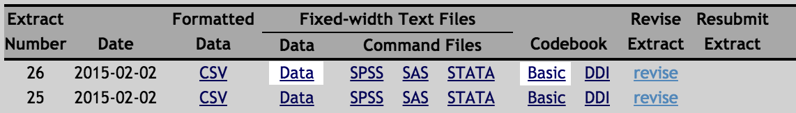

node-ipums
==========

Parse IPUMS files with Node to create clean, human-readable data files.

### Installing

Clone this repo and install dependencies:

	git clone https://github.com/TimeMagazine/node-ipums.git && cd node-ipums
	npm install

### Example

For this module to work, you need two files from your IPUMS data extract: The raw `.dat` file, in which each row of data is contained in one long string, and the basic codebook file, which decodes that string into fields and ends in a `.cbk` extension:

This repo comes with a sample extract from IPUMS with 2013 data for age, sex, education, and marital status. In this example, we're going to be investigating whether educational attainment has a major effect on the age of marriage.

The data file you need is compressed, so go ahead and extract it:

	gzip -d test/usa_00028.dat.gz

If you have a look at the above file, you'll see it doesn't make a tremendous amount of sense to the naked eye:

	head -n 5 test/usa_00028.dat

Yields: 

	2013010000000100000065004000100000065002019607071
	2013010000000200000051001000100000051002055108081
	2013010000000200000051001000200000062001056106063
	2013010000000200000051001000300000232001021607071
	2013010000000200000051001000400000097002021607071

This is because the data you want is all mashed together into one long string. To decode it, you would need to consult the codebook file, `test/usa_00028.cbk`, which defines which characters belong to which fields. In this case, we see:

	File Type:                    rectangular
	Case Selection:               No
	  Variable               Columns        Len    2013   
	  YEAR               H   1-4            4      X 
	  DATANUM            H   5-6            2      X 
	  SERIAL             H   7-14           8      X 
	  HHWT               H  15-24          10      X 
	  GQ                 H  25              1      X 
	  PERNUM             P  26-29           4      X 
	  PERWT              P  30-39          10      X 
	  SEX                P  40              1      X 
	  AGE                P  41-43           3      X 
	  MARST              P  44              1      X 
	  EDUC               P  45-46           2      X 
	  EDUCD              P  47-49           3      X 

This tells us, for example, that the 44th character (starting from 1, not 0) refers to MARST, the marriage variable. Of course, '6' is not a type of marriage. Further down in the same file you'll find the codes that map these numbers to their real-world values:

	 MARST		Marital status
	1		Married, spouse present
	2		Married, spouse absent
	3		Separated
	4		Divorced
	5		Widowed
	6		Never married/single

In fact, IPUMS allows you to skip the `.dat` file and download a `.csv` instead, but doing so does not get us past the problem of getting numbers instead of values. The csv version of this file looks like this:

	"YEAR","DATANUM","SERIAL","HHWT","GQ","PERNUM","PERWT","SEX","AGE","MARST","EDUC","EDUCD"
	2013,1,1,65,4,1,65,2,19,6,7,71
	2013,1,2,51,1,1,51,2,55,1,8,81
	2013,1,2,51,1,2,62,1,56,1,6,63
	2013,1,2,51,1,3,232,1,21,6,7,71

That's a bit more useful, but still difficult to make sense of. Fortunately, one of this module's main functions is to automatically translate the `.dat` file into something you can understand. To do so, you just run the following command:

	./index.js csv test/usa_00028

This will take about a minute to run -- we've got 3 million rows to crunch through! Eventually you'll see something like this:

	Finished parsing 3132795 lines in 56 seconds.
	Wrote output to test/usa_00028.tsv

Let's have a look:

	head -n 5 test/usa_00028.tsv

Yields:

	YEAR	SERIAL	HHWT	GQ	PERWT	SEX	AGE	MARST	EDUC	EDUCD
	2013	1	6500	Other group quarters	65	Female	19	Never married/single	1 year of college	1 or more years of college credit, no degree
	2013	2	5100	Households under 1970 definition	51	Female	55	Married, spouse present	2 years of college	Associate's degree, type not specified
	2013	2	5100	Households under 1970 definition	62	Male	56	Married, spouse present	Grade 12	Regular high school diploma
	2013	2	5100	Households under 1970 definition	232	Male	21	Never married/single	1 year of college	1 or more years of college credit, no degree

As you see, the script applied the codebook definitions to each line of the file and spat it back out as a tab-delimited file with the plain-English values instead of the numbers. You can now easily import this file into Excel, a SQL database, or anything else that understands tab-delimited csvs.

### Usage

Specify the name of the file you want to parse, without any extension, e.g.:

	./index.js /path/to/usa_00028

This will look for two files: `/path/to/usa_00028.dat` and `/path/to/usa_00028.cbk`. It will write to `/path/to/usa_00028.tsv`.

For large files, you may want to pump in more memory:

	node --max-old-space-size=8192 index.js /Users/myusername/Downloads/usa_00028

### Options

#### Buckets

You may want to combine some granular fields, like age, into ranges of values (or "buckets"), like 18-21, 22,25, and so forth. To do so, you pass a `buckets` parameters like so:

	node index.js /Users/myusername/Downloads/usa_00001 --buckets=age,education

If you want to reduce the resulting file size, pass `--reduced`, which will delete the fields that get condensed into buckets.

#### Reducing file size

You can eliminate fields from the original IPUMs file by passing them to the `ignore` parameter:

	node index.js /Users/myusername/Downloads/usa_00011 --ignore=AGE,SEX

### Patience

With the extra memory and reduced output, this can churn through 15 million lines in about 300 seconds. You can adjust the number of lines it buffers before writing (10,000, by default) with `--buffer`.

### What the hell, my "refined" file is twice the size of the original!

That's because it filled in the verbose values for the fields -- "Married, spouse present" instead of "6", etc. Deal with it. 